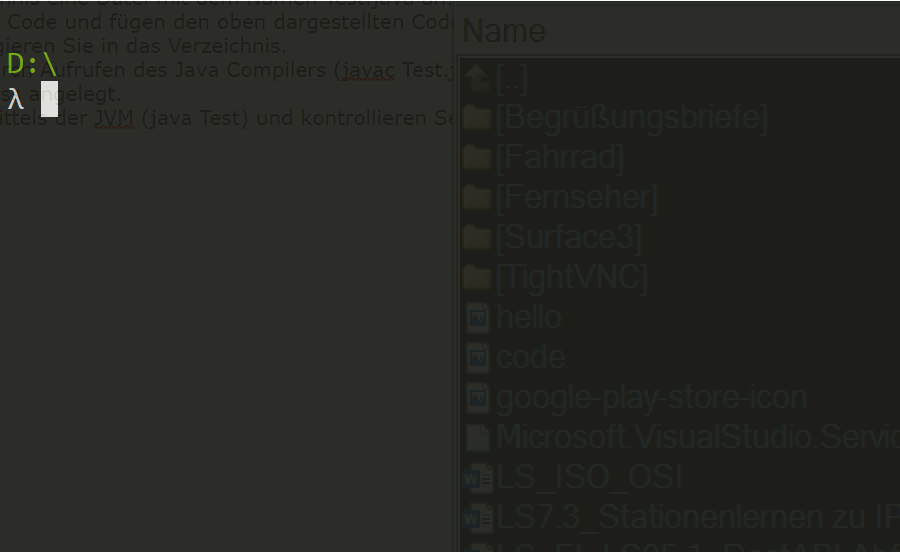
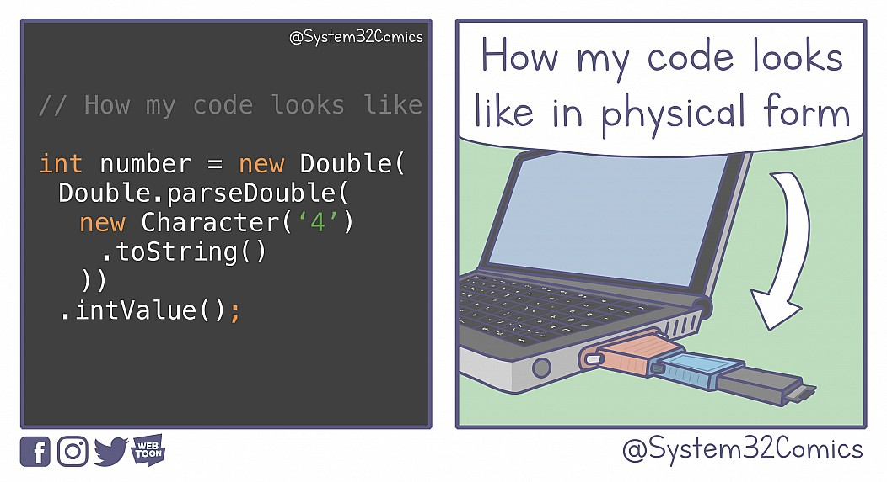

# Lernsituation 1


 **Ein lokaler Nahrungsmittelerzeuger, die GoodFood GmbH, beauftragt die ChangeIT GmbH ein Kassensystem zu entwickeln, um die Erzeugnisse der GoodFood GmbH zu verkaufen und die Umsätze zu verwalten.**
 
 **Als Auszubildender wirken Sie bei der Umsetzung des Projektes mit.**

## Funktionale und nicht Funktionale Anforderungen an eine Software

Der Auftraggeber stellt Ihnen für den Auftrag ein Lastenheft zur Verfügung, welches beschreibt welche _funktionalen_ und _nicht funktionalen_ Anforderungen die Software zu erfüllen hat.

---

**Lastenheft: Modernes Kassensystem für die GoodFood GmbH**

**Istsituation:**

Die GoodFood GmbH betreibt derzeit zwei Filialen, in denen lokale landwirtschaftliche Erzeugnisse wie Obst und Gemüse verkauft werden. Beide Filialen sind aktuell mit einer analogen Registrierkasse ausgestattet. Diese Kasse dient primär der Verwaltung der täglichen Einnahmen. Jeden Tag nach Geschäftsschluss überträgt der Filialleiter die Einnahmen manuell in eine Excel-Tabelle. Dieser Prozess ist zeitaufwändig und birgt das Risiko von Fehlern oder Inkonsistenzen in den erfassten Daten. Die gesammelten Daten in der Excel-Tabelle werden am Ende des Monats verwendet, um eine Umsatzstatistik für die jeweilige Filiale zu erstellen. Diese manuelle Handhabung und die Abhängigkeit von analogen Mitteln begrenzen die Effizienz und Flexibilität im Geschäftsbetrieb. Es besteht ein deutliches Potenzial für Automatisierung und Digitalisierung, um den Arbeitsaufwand zu reduzieren und die Genauigkeit und Schnelligkeit der Datenverarbeitung zu erhöhen.

**Anforderungen und Neugestaltung:**

Die GoodFood GmbH plant die Einführung eines modernen Kassensystems, um den Geschäftsalltag effizienter und benutzerfreundlicher zu gestalten. Bei der Konzeption dieses Systems stehen diverse Anforderungen im Vordergrund.

Inmitten des geschäftigen Alltags der Filiale sollen Verkäufer die Möglichkeit haben, sich mittels einer persönlichen PIN am Kassensystem anzumelden. Diese Authentifizierung sorgt für eine klare Zuordnung der Verkaufsvorgänge und erhöht die Sicherheit des Systems. Es sollte zudem möglich sein, sowohl Stückwaren mit festen Preisen als auch gewichtsbasierte Waren, wie Obst und Gemüse, effizient zu erfassen. Dabei muss der Preis basierend auf dem €/kg-Wert berechnet werden.

Ein wichtiger Zusatzaspekt des Kassensystems ist der Import von neuen Produkten. Neben der kontinuierlichen Anpassung der Produktpalette sollte das Kassensystem die Möglichkeit bieten, neue Produkte in das System zu importieren. Nur der Filialleiter ist berechtigt, diesen Produktimport durchzuführen. Das System muss Daten aus Excel-Dateien direkt importieren können und den Importprozess benutzerfreundlich gestalten.

Die Benutzeroberfläche des Kassensystems sollte intuitiv und verständlich sein. Die Sicherheit darf nicht vernachlässigt werden. Neben der sicheren Authentifizierung der Mitarbeiter müssen alle Transaktionen und Kundendaten sicher und vor externen Angriffen geschützt werden. Das System sollte in Echtzeit reagieren und eine konstant hohe Leistung bieten.

Ein weiterer Aspekt ist die Stornierung von Verkaufsvorgängen. Verkäufe sollten rückgängig gemacht werden können, aber nur vom Filialleiter, um Missbrauch zu verhindern.

Abschließend sollte das Kassensystem die Möglichkeit bieten, Umsatzstatistiken zu generieren, um den Erfolg der Filiale zu überwachen und gegebenenfalls Anpassungen vorzunehmen.

### Aufgabe 1

Ermitteln Sie die funktionalen und nicht funktionalen Anforderungen an die zu entwickelnde Software und stelle Sie diese in Form einer Tabelle dar.

### Lösung 1

| Typ              | Anforderung                                                                |
|------------------|----------------------------------------------------------------------------|
| **Funktional**   | - Verkäuferanmeldung mittels persönlicher PIN                               |
|                  | - Erfassung von Stückwaren und gewichtsbasierten Waren (Preisberechnung in €/kg)|
|                  | - Stornierung von Verkaufsvorgängen ausschließlich durch den Filialleiter  |
|                  | - Import von neuen Produkten durch den Filialleiter  |
| **Nichtfunktional** | - Benutzerfreundlichkeit (intuitive Bedienung)                            |
|                  | - Sicherheit (Datenschutz, Authentifizierung, Schutz vor externen Angriffen)|
|                  | - Performance (Echtzeit-Reaktion, hohe Leistungsfähigkeit)                  |

## Das Pflichtenheft

### Aufgabe 2

Informieren Sie sich über den Inhalt eines Pflichtenheftes und Schreiben Sie in der Rolle des _Auftragnehmers_ ein Pflichtenheft für den Auftrag.

> Bewerten Sie gegenseitig die Qualität des erstellten Pflichtenheftes. Möglich Bewertungskriterien sind:
>
> - Vollständigkeit: Sind alle Anforderungen aus dem Lastenheft aufgenommen und Vorschläge zur Umsetzung enthalten.
> - Ressourcenplanung: Wird genannt welche zeitlichen und personellen Ressourcen benötigt werden.
> - Technische Details: Werden technische Details für die Umsetzung genannt? Wird eine Programmiersprache und eine Datenbank ausgewählt? Wird ggf. auf eine Architektur wie Client / Server eingegangen?
> - Validierung und Testkriterien: Wir erwähnt wie die Qualität der zu entwickelnden Software nachgewiesen werden soll?

# Lernsituation 2

## Die Programmiersprache JAVA

### Aufgabe 3

Die Implementierung der Software soll in einer aktuellen Programmiersprache erfolgen. Sammeln Sie Namen von Programmiersprachen von denen Sie schon einmal gehört haben.

> Gruppieren Sie die Sprache hinsichtlich der Ausführung der Sprache und teilen Sie die Sprachen in **Compiler-Sprachen** und **Interpreter-Sprachen** ein! 

### Aufgabe 4

Da in der Change IT GmbH bereits vielfältige Erfahrungen mit der Programmiersprache JAVA vorliegen, entscheidet sich die Geschäftsleitung der ChangeIT GmbH dafür auch diese Software in Java zu implementieren. Installieren Sie daher ein aktuelles Java Software Development Kit (SDK) auf ihrem Rechner. 

1. Starten Sie eine Kontogenanwendung! 
1. Erzeugen Sie auf ihrer Festplatte ein leeres Verzeichnis und wecheln Sie in dieses Verzeichnis
1. Starten Sie einen Editor auf ihrem PC (*notepad* bei windows, *nano* bei Linux/MacOS) Tippen Sie den unten abgebildeten Source Code ab und speichern Sie den Sourcecode in der Datei **Test.java**.
2. Übersetzen Sie den Sourcecode mittels des Java Compilers **javac** in Bytecode
3. Führen Sie das Programm mit Hilfe der Java Virtual Machine **java** aus.

```java
1. public class Test {
2.
3.     public static void main(String[] args) {
4.         System.out.println("Hallo Welt");
5.     }
6. }

```

*Hinweise*:

- Beachten Sie dass die Datei ebenso heißt wie der Name der Klasse (hier **Test**).
- Beachten Sie dass Java zwischen Groß- und Kleinschreibung unterscheidet
- Das eigentlich Programm befindet sich in der Zeile 4
- Der Anweisung wird in Java mittels eines Semikolons abgeschlossen.



## Arbeiten mit einer Versionskontrolle

Die Software soll gemeinsam in Entwicklerteam der ChangeIT GmbH von mehreren Entwicklern implementiert werden. Zur Koordinierung des Entwicklungsprozesses soll eine Versionskontrolle genutzt werden.

### Aufgabe 5

Sammeln Sie im Klassenverband Aspekte die eine Versionsverwaltungs-Software zu erfüllen hat. 

In vergangenen Projekte wurden bereits die Versionssoftware **git** eingesetzt. Auch das neue Projekt soll mittels dieser Versionsverwaltungs-Software umgesetzt werden. Installieren Sie sich daher zunächst [git](https://git-scm.com/downloads) auf ihrem PC.

### Aufgabe 6

Die Versionsverwaltung **git** ist eine Kontogenanwendung. Informieren Sie sich über die wichtigsten Kommandos des Programms **git**.

Führen Sie den folgenden Arbeitsprozess durch. Notieren Sie sich dabei die verwendeten **git-Befehle**.

1. Erstellen Sie im zuvor angelegten Verzeichnis ein git Repository.
2. Fügen Sie die Datei *Test.java* dem Repository hinzu (**stagen**).
3. *Committen* Sie die Datei *Test.java* in das Repository.
4. Erzeugen Sie einen neuen Branch mit dem Namen "dev" und wechseln Sie in diesen Branch.
5. Verändern Sie den Programmcode dahingehend, dass "Hello {Bezeichnung ihrer Klasse}" ausgegeben wird.
6. Fügen Sie die Änderungen dem Repository hinzu.
7. Wechseln Sie in den master Branch des Repositories und fügen Sie den "dev" Branch mit dem "master" Branch zusammen.
8. Lassen Sie sich alle Commit Nachrichten anzeigen.

## Arbeiten mit einer Entwicklungsumgebung

Die Entwicklungen im Team der ChangeIT GmbH erfolgen zumeist mit dem Editor VS Code. Installieren Sie sich den Editor [VS Code](https://code.visualstudio.com/docs/languages/java) inkl. der notwendigen Erweiterungen zum Starten und Debuggen eines JAVA Programms.

### Aufgabe 7

Öffnen Sie das zuvor erstellte Verzeichnis mit dem Editor VS Code.

Ermitteln Sie, wie ihnen der Editor bei den folgenden Arbeitsprozesses hilft.

- Führen Sie das Programm *Test.java* mit Hilfe von VS Code aus.
- Setzen Sie einen Haltepunkt in der Zeile 4 des Programms und starten Sie das Programm im Debug Modus.
- Wechseln Sie auf den "dev" Branch und erweitern Sie das Programm um eine weitere Ausgabe.
- Committen Sie die Änderungen am Programm
- Führen Sie den "dev" Branch mit dem "master" Branch zusammen.

## Ein- und Ausgaben

Eingaben im Kassensystem für die GoodFood GmbH erfolgen zum Teil über die Tastatur (Eingabe des PINs für den Kassierer). Die Ausgaben erfolgen auf dem Bildschirm des Kassensystems.  Wie Ausgaben in JAVA zu realisieren sind, zeigt bereits unser anfänglich entwickeltes Beispielprogramm. So erzeugt:

```java
System.out.println("Hallo Welt");
```

Die Ausgabe "*Hallo Welt*" auf dem Standrad Ausgabegerät (zumeist der Bildschirm). Informieren Sie sich wie Sie mittels JAVA von der Tastatur Daten einlesen können.

### Aufgabe 8

Erstellen Sie ein Programm welches den Anwender nach seinem Namen fragt und anschließend nach seiner Anrede und anschließend die Ausgabe erzeugt "Hallo {Anrede} {Name}".

## Datentypen und Typumwandlung

Java zählt zu den **starktypisierten** und **objektorientierten** Programmiersprachen. Informieren Sie sich welche *primitiven* Datentypen in Java existieren und wie diese umgewandelt werden können. Erarbeiten Sie dazu den Unterschied zwischen *impliziten Casten* und *expliziten Casten*. Erörtern Sie im weiten Verlauf, wie sie die *Wrapper* Klassen dazu nutzen können, um Daten, die als Zeichenketten vorliegen in einen einen primitiven Datentyp zu wandeln.

> Erörtern Sie im Klassenverband was uns der "Künstler" mit dem unten abgebildeten Bild sagen wollte?



> Im Jahr 2022 sorgte ein Fehler bei MS Exchange dafür, dass keine Emails mehr zugestellt werden konnten. Lesen Sie sich den folgenden [Artikel](images/Exchange_Bug.pdf) durch und diskutieren im Klassenverband, wie es zu diesem Fehler kommen konnte.

### Aufgabe 9

- Definieren Sie zwei Variablen vom Type String in Java mit dem Namen umfang und dem Wert "3.14" und dem Namen alter vom Datentype String mit dem Wert "25".
- Wandeln Sie die Variablen in den Datentyp Integer bzw. in Double um (Nutzen Sie hierzu die entsprechenden Wrapper Klassen).
- Multiplizieren Sie die Variable umfang mit 2.0 und addieren Sie zur Variablen alter 3 hinzu.
- Weisen Sie anschließen die neu berechneten Werte den Variablen umfang und alter hinzu (dazu müssen die Datentypen Integer und Double wieder in den Datentyp String gewandelt werden).

## Operatoren

Einige Programmabschnitte im Kassensystem für die GoodFood GmbH erfolgen nach dem sogenannten **EVA** Prinzip. Dieses steht für **E**ingabe, **V**erabeitung und **A**ausgabe. Wie Ein- und Ausgaben zu realisieren sind haben wir bereits im vorherigen Kapitel erörtert. In diesem Kapitel geht es nun um die Verarbeitung von Daten mittels Operatoren. Informieren Sie sich über folgende Operatoren in Java:

- arithmetische Operatoren
- Vergleichsoperatoren
- logische Operatoren

### Aufgabe 10

Entwickeln Sie ein Programm, welchen den Benutzer nach einen Länge in m fragt und dann dem Benutzer anzeigt wie groß ein Quadrat in $cm^2$ und einen Würfel in $cm^3$ mit der gegebenen Länge wäre.

```txt
Länge in m?: 0.15

Ein Quadrat mit der Kantenlänge von 0.15m hätte eine Fläche von 225 cm^2.
Ein Würfel mit der Kantenlänge von 0.15m hätte ein Volumen von 3375 cm^3.

```

### Lösung Aufgabe 10

```java
public class QuadratWuerfel {
    public static void main(String[] args) {
        Scanner scanner = new Scanner(System.in, "iso-8859-1");
        System.out.print("Seitenlänge in m:");
        float l = Float.parseFloat(scanner.nextLine());
        float a = l*l*100*100;
        float v = l*l*l*100*100*100;
        System.out.println("Ein Würfel hätte eine Fläche von "+a+"m^2 und ein Würfel das Volumen von "+v+"m^3");
        
    }
}
```

### Aufgabe 11

Entwickeln Sie ein Programm, welchen den Benutzer nach einer Anzahl von Minuten fragt und dass diese Anzahl ausgibt in der Form dd:hh:mm !

```txt
Anzahl von Minuten: 4000

4000 Minuten entsprechen 2 Tage, 18 Stunden und 40 Minuten!
```

### Lösung Aufgabe 11

```java
import java.util.Scanner;

public class Minuten {
    public static void main(String[] args) {
        Scanner s = new Scanner(System.in);
        int minuten=0;
        int stunden=0;
        int tage=0;
        System.out.print("Abzahl der Minuten:");
        minuten=s.nextInt();
        tage=minuten/1440;
        minuten=minuten-tage*1440;
        stunden=minuten/60;
        minuten=minuten-stunden*60;
        System.out.println(tage+":"+stunden+":"+minuten);
    }
    
}
```

## Funktionen und Methoden

Oft werden Teile eines Programmes wiederverwertet und die Logik in einer Funktion bzw. Methode ausgelagert. Informieren Sie sich darüber, wie in Java Logik in Methoden ausgelagert werden kann. Erarbeiten Sie dabei den Unterschied zwischen *call by value* und *call by reference*.

### Aufgabe 12

Zum Abrechnen von Bulkware (Ware deren Preis in €/kg angegeben wird) soll eine Methode _calcPrice_ entwickelt werden. Diese enthält den Preis in €/kg und das ermittelte Gewicht in kg und liefert als Ergebnis den Preis in €.

```txt
+ calcPrice(eur_per_kg:double,kg:double):double
```

Rufen Sie innerhalb der *main*-Methode ihre Funktion mit folgenden Werten aus und überprüfen Sie das Ergebnis.

| Preis je kg | Menge | erwartetes Ergebnis | erhaltenes Ergebnis |
| ----------- | ----- | ------------------- | ------------------- |
| 2.5         | 5     | 12.5                |                     |
| 0.75        | 8     | 6                   |                     |
| 1.25        | 15    | 18.75               |                     |
| 0.8         | 5     | 4                   |                     |
| 0.5         | 1.25  | 0.625               |                     |

> Mit Hilfe der obigen Tabelle haben Sie die Korrektheit ihrer entwickelten Methode nachgewiesen. Diskutieren Sie im Klassenverband, wie dieses **Test** heißen könnte.

## Fragen zum Verständnis

Welche der folgenden Aussagen über den Java-Compiler und die Java Virtual Machine (JVM) ist korrekt?

- [ ] A) Der Java-Compiler erzeugt direkt ausführbaren Maschinencode.
- [ ] B) Die JVM ist nur dafür verantwortlich, Java-Bytecode zu interpretieren, sie kann ihn nicht kompilieren.
- [ ] C) Der Java-Compiler erzeugt Bytecode, der plattformunabhängig ist und von der JVM interpretiert wird.
- [ ] D) Bytecode ist lediglich eine komprimierte Form von Java-Quellcode.

---

Was beschreibt das Pflichtenheft im Gegensatz zum Lastenheft genauer?

- [ ] A) Die allgemeinen Erwartungen des Kunden.
- [ ] B) Die technische Spezifikation und konkrete Umsetzungsanforderungen.
- [ ] C) Den wirtschaftlichen Hintergrund des Projekts.
- [ ] D) Die Nutzeranforderungen aus der Sicht des Endanwenders.

---

Welche der folgenden Aussagen zu Git, einem beliebten Tool für die Versionskontrolle, ist **nicht** korrekt?

- [ ] A) Bei Git handelt es sich um ein zentralisiertes Versionskontrollsystem.
- [ ] B) Mit Git können Entwickler parallel in verschiedenen Branches arbeiten.
- [ ] C) Git ermöglicht das Zusammenführen von Änderungen durch den Merge-Vorgang.
- [ ] D) Git bietet die Möglichkeit, frühere Versionen eines Projekts zu betrachten.

---

Wofür steht das Akronym EVA im Kontext von Computersystemen?

- [ ] Entwickeln, Verifizieren, Aktualisieren
- [ ] Eingabe, Verarbeitung, Ausgabe
- [ ] Evaluieren, Verteilen, Anwenden
- [ ] Extrahieren, Visualisieren, Archivieren

---

Gegeben sei der folgende Java-Code:

```java
double x = 10.5;
int y = (short) x;
```
Welchen Wert hat y nach Ausführung dieses Codes?

- [ ] 10,5
- [ ] 10
- [ ] 11
- [ ] Es wird einen Kompilierfehler geben.

---

Welches Ergebnis liefert der folgende Java-Code?

```java
int x = 10;
int y = 3;
int z = x % y;
```

Was ist der Wert von z nach Ausführung des Codes?

- [ ] 3
- [ ] 2
- [ ] 1
- [ ] 0

---

Betrachten Sie den folgenden Java-Code:

```java
public class Test {
    public static void main(String[] args) {
        StringBuilder str = new StringBuilder("Hello");
        modifyString(str);
        System.out.println(str);
    }

    public static void modifyString(StringBuilder s) {
        s.append(" World");
    }
}
```

Was wird der obige Code ausgeben?

- [ ] "Hello"
- [ ] "Hello World"
- [ ] "World"
- [ ] Ein Fehler wird ausgegeben

---

Betrachten Sie den folgenden Java-Code:

```java
public class TestValue {
    public static void main(String[] args) {
        int number = 5;
        modifyValue(number);
        System.out.println(number);
    }

    public static void modifyValue(int num) {
        num = num * 2;
    }
}
```

Was gibt der obige Code aus?

- [ ] 5
- [ ] 10
- [ ] 0
- [ ] Es wird ein Fehler ausgegeben

