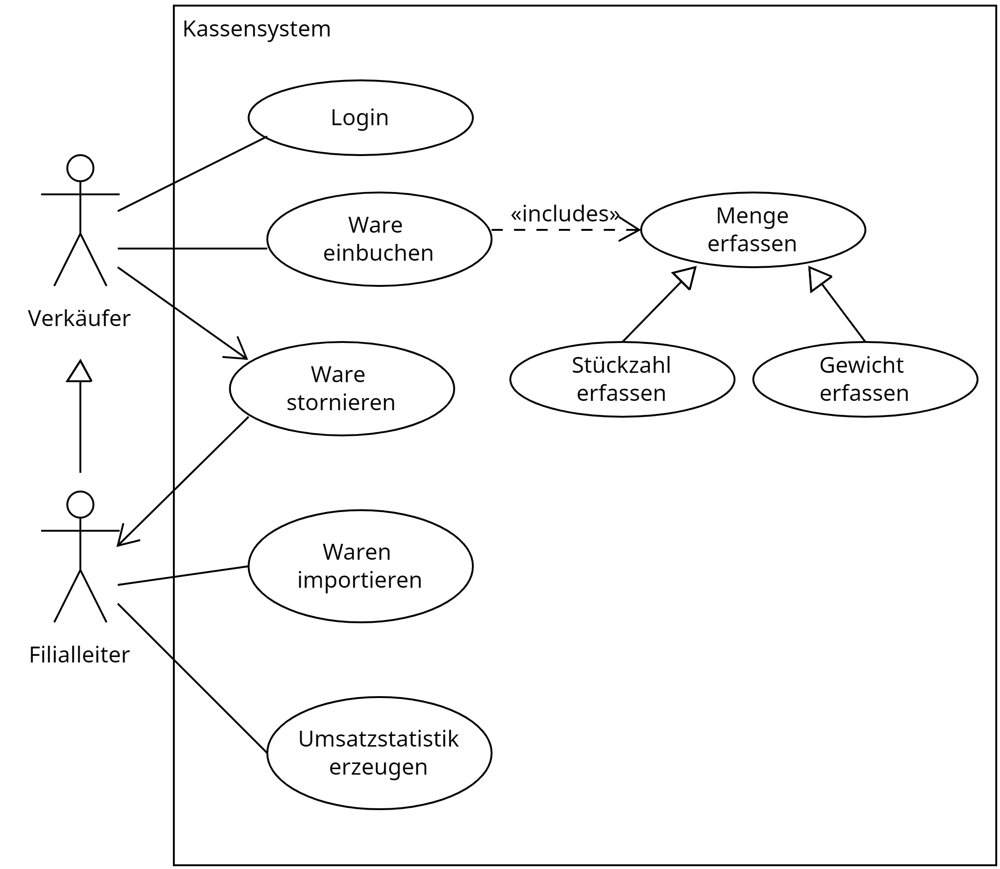

# Lernsituation 1

 **Ein lokaler Nahrungsmittelerzeuger, die GoodFood GmbH, beauftragt die ChangeIT GmbH ein Kassensystem zu entwickeln, um die Erzeugnisse der GoodFood GmbH zu verkaufen und die Umsätze zu verwalten.**
 
 **Als Auszubildender wirken Sie bei der Umsetzung des Projektes mit.**

## Funktionale und nicht Funktionale Anforderungen an eine Software

<!--ls1aufgabe1-->

Der Auftraggeber stellt Ihnen für den Auftrag ein Lastenheft zur Verfügung, welches beschreibt welche _funktionalen_ und _nicht funktionalen_ Anforderungen die Software zu erfüllen hat.

---

**Lastenheft: Modernes Kassensystem für die GoodFood GmbH**

**Istsituation:**

Die GoodFood GmbH betreibt derzeit zwei Filialen, in denen lokale landwirtschaftliche Erzeugnisse wie Obst und Gemüse verkauft werden. Beide Filialen sind aktuell mit einer analogen Registrierkasse ausgestattet. Diese Kasse dient primär der Verwaltung der täglichen Einnahmen. Jeden Tag nach Geschäftsschluss überträgt der Filialleiter die Einnahmen manuell in eine Excel-Tabelle. Dieser Prozess ist zeitaufwändig und birgt das Risiko von Fehlern oder Inkonsistenzen in den erfassten Daten. Die gesammelten Daten in der Excel-Tabelle werden am Ende des Monats verwendet, um eine Umsatzstatistik für die jeweilige Filiale zu erstellen. Diese manuelle Handhabung und die Abhängigkeit von analogen Mitteln begrenzen die Effizienz und Flexibilität im Geschäftsbetrieb. Es besteht ein deutliches Potenzial für Automatisierung und Digitalisierung, um den Arbeitsaufwand zu reduzieren und die Genauigkeit und Schnelligkeit der Datenverarbeitung zu erhöhen.

**Anforderungen und Neugestaltung:**

Die GoodFood GmbH plant die Einführung eines modernen Kassensystems, um den Geschäftsalltag effizienter und benutzerfreundlicher zu gestalten. Bei der Konzeption dieses Systems stehen diverse Anforderungen im Vordergrund.

Inmitten des geschäftigen Alltags der Filiale sollen Verkäufer die Möglichkeit haben, sich mittels einer persönlichen PIN am Kassensystem anzumelden. Diese Authentifizierung sorgt für eine klare Zuordnung der Verkaufsvorgänge und erhöht die Sicherheit des Systems. Es sollte zudem möglich sein, sowohl Stückwaren mit festen Preisen als auch gewichtsbasierte Waren, wie Obst und Gemüse, effizient zu erfassen. Dabei muss der Preis basierend auf dem €/kg-Wert berechnet werden.

Ein wichtiger Zusatzaspekt des Kassensystems ist der Import von neuen Produkten. Neben der kontinuierlichen Anpassung der Produktpalette sollte das Kassensystem die Möglichkeit bieten, neue Produkte in das System zu importieren. Nur der Filialleiter ist berechtigt, diesen Produktimport durchzuführen. Das System muss Daten aus Excel-Dateien direkt importieren können und den Importprozess benutzerfreundlich gestalten.

Die Benutzeroberfläche des Kassensystems sollte intuitiv und verständlich sein. Die Sicherheit darf nicht vernachlässigt werden. Neben der sicheren Authentifizierung der Mitarbeiter müssen alle Transaktionen und Kundendaten sicher und vor externen Angriffen geschützt werden. Das System sollte in Echtzeit reagieren und eine konstant hohe Leistung bieten.

Ein weiterer Aspekt ist die Stornierung von Verkaufsvorgängen. Verkäufe sollten rückgängig gemacht werden können, aber nur vom Filialleiter, um Missbrauch zu verhindern.

Abschließend sollte das Kassensystem die Möglichkeit bieten, Umsatzstatistiken zu generieren, um den Erfolg der Filiale zu überwachen und gegebenenfalls Anpassungen vorzunehmen.

### Aufgabe 1

Ermitteln Sie die funktionalen und nicht funktionalen Anforderungen an die zu entwickelnde Software und stelle Sie diese in Form einer Tabelle dar.

<!--ls1aufgabe1-->
<!--ls1lsg1-->

### Lösung 1

| Typ              | Anforderung                                                                |
|------------------|----------------------------------------------------------------------------|
| **Funktional**   | - Verkäuferanmeldung mittels persönlicher PIN                               |
|                  | - Erfassung von Stückwaren und gewichtsbasierten Waren (Preisberechnung in €/kg)|
|                  | - Stornierung von Verkaufsvorgängen ausschließlich durch den Filialleiter  |
|                  | - Import von neuen Produkten durch den Filialleiter  |
| **Nichtfunktional** | - Benutzerfreundlichkeit (intuitive Bedienung)                            |
|                  | - Sicherheit (Datenschutz, Authentifizierung, Schutz vor externen Angriffen)|
|                  | - Performance (Echtzeit-Reaktion, hohe Leistungsfähigkeit)                  |

<!--ls1lsg1-->
<!--ls1aufgabe2-->

## Das Pflichtenheft

### Aufgabe 2

Informieren Sie sich über den Inhalt eines Pflichtenheftes und Schreiben Sie in der Rolle des _Auftragnehmers_ ein Pflichtenheft für den Auftrag.

<!--ls1aufgabe2-->

> Bewerten Sie gegenseitig die Qualität des erstellten Pflichtenheftes. Möglich Bewertungskriterien sind:
>
> - Vollständigkeit: Sind alle Anforderungen aus dem Lastenheft aufgenommen und Vorschläge zur Umsetzung enthalten.
> - Ressourcenplanung: Wird genannt welche zeitlichen und personellen Ressourcen benötigt werden.
> - Technische Details: Werden technische Details für die Umsetzung genannt? Wird eine Programmiersprache und eine Datenbank ausgewählt? Wird ggf. auf eine Architektur wie Client / Server eingegangen?
> - Validierung und Testkriterien: Wir erwähnt wie die Qualität der zu entwickelnden Software nachgewiesen werden soll?

<!--ls1aufgabe3-->
### Aufgabe 3

Leider ist die sprachliche Beschreibung der funktionalen Anforderungen aus dem Pflichten- und Lastenheft nicht eindeutig und widerspruchsfrei genug. Geeigneter erscheint hier die Dokumentation in Form eines UML **Use Case Diagramms**. Dieses Diagramm, stell in einer einfachen grafischen Notation dar, **was** (der Use Case) ein **Akteur** mit dem System macht.

1. Informieren Sie sich über die Notation des UML Use Case Diagramms ([Link Tipp](https://www.sparxsystems.de/ressourcen/literatur/leseprobe-zu-projektabwicklung-mit-uml-und-enterprise-architect/anwendungsfalldiagramm-use-case-diagram))
2. Zeichnen Sie ein UML Use Case Diagramm für die funktionalen Anforderungen des Kassensystems.

<!--ls1aufgabe3-->

> Bewerten Sie gegenseitig die Qualität des erstellten Use Cae Diagramms. Möglich Bewertungskriterien sind:
>
> - Vollständigkeit: Sind alle Akteure und alle Use-Cases abgebildet?
> - Korrektheit: Zeigen *include* Anweisungen auf den zu inkludierenden Anwendungsfall, zeigen *extends* Anweisungen auf den zu erweiternden Anwendungsfall, zeigen Generalisierung auf den generalisierten Anwendungsfall

### Musterlösung Aufgabe 3

## Fragen zum Verständnis

Was beschreibt das Pflichtenheft im Gegensatz zum Lastenheft genauer?

- [ ] A) Die allgemeinen Erwartungen des Kunden.
- [ ] B) Die technische Spezifikation und konkrete Umsetzungsanforderungen.
- [ ] C) Den wirtschaftlichen Hintergrund des Projekts.
- [ ] D) Die Nutzeranforderungen aus der Sicht des Endanwenders.

---

Was sind funktionale Anforderungen in der Softwareentwicklung?

- [ ] A) Eigenschaften des Systems, die dessen Leistungsfähigkeit, Zuverlässigkeit oder Skalierbarkeit beschreiben.
- [ ] B) Spezifikationen, die beschreiben, wie das System auf bestimmte Eingaben reagieren soll.
- [ ] C) Anforderungen, die sich auf die Benutzerfreundlichkeit oder das ästhetische Erscheinungsbild der Software beziehen.
- [ ] D) Anforderungen, die beschreiben, wie das System mit anderen Systemen interagieren soll.

---

Welches der folgenden Beispiele beschreibt am ehesten eine nicht funktionale Anforderung?

- [ ] A) Die Software soll Daten in eine Datenbank speichern können.
- [ ] B) Die Benutzeroberfläche der Software soll intuitiv und benutzerfreundlich sein.
- [ ] C) Die Software muss in der Lage sein, PDF-Dokumente zu generieren.
- [ ] D) Das System soll Benachrichtigungen an den Benutzer senden können.

---

Welche Aussage beschreibt die „include“-Beziehung in einem UML Use Case Diagramm am besten?

- [ ] A) Sie repräsentiert eine optionale Beziehung, bei der ein Use Case unter bestimmten Bedingungen einen anderen Use Case aufruft.
- [ ] B) Sie zeigt, dass ein Use Case immer einen anderen Use Case aufruft, um eine bestimmte Funktionalität sicherzustellen.
- [ ] C) Sie drückt aus, dass ein Akteur in einem spezifischen Use Case verallgemeinert oder spezialisiert werden kann.
- [ ] D) Sie stellt eine Beziehung dar, bei der zwei Use Cases gleichzeitig aktiviert werden müssen.

---

Wie wird die „Generalisierung“-Beziehung zwischen Akteuren in einem UML Use Case Diagramm dargestellt?

- [ ] A) Durch eine durchgehende Linie mit einer offenen Pfeilspitze, die auf den allgemeineren Akteur zeigt.
- [ ] B) Durch eine gestrichelte Linie mit einer geschlossenen Pfeilspitze, die auf den spezielleren Use Case zeigt.
- [ ] C) Durch eine doppelte Linie ohne Pfeilspitze.
- [ ] D) Durch eine gestrichelte Linie mit einer offenen Pfeilspitze, die auf den einschließenden Use Case zeigt.
