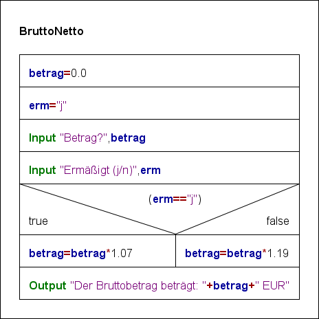
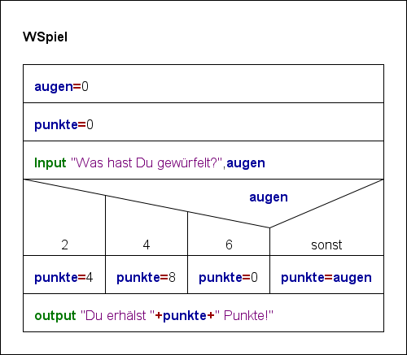
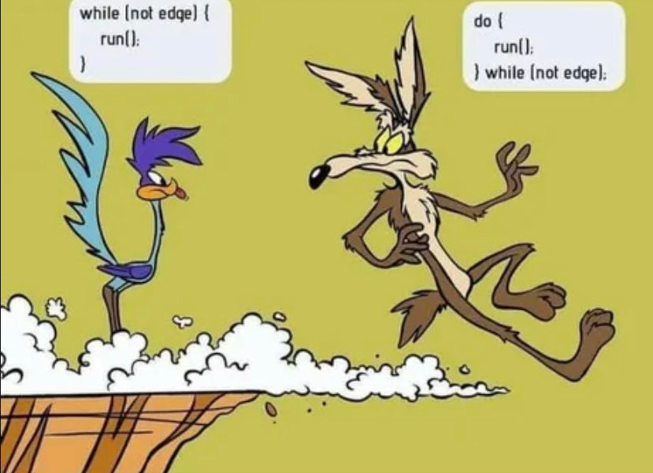
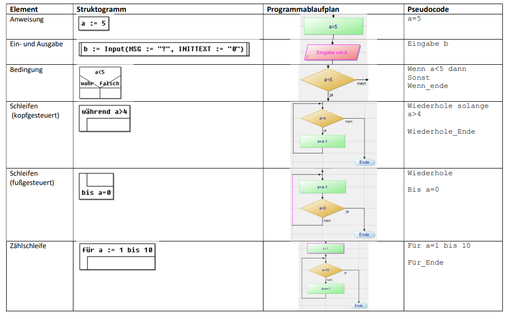
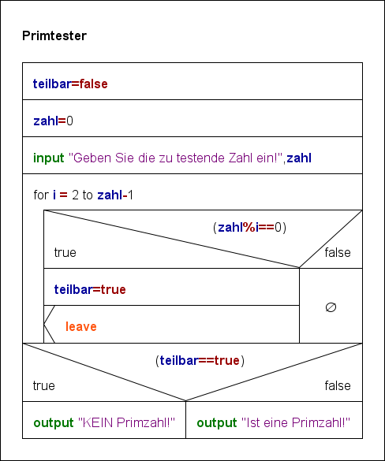
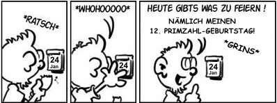
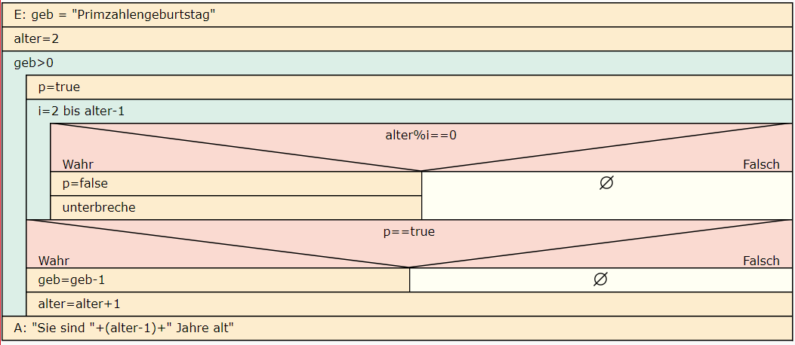
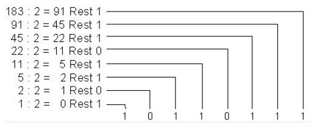
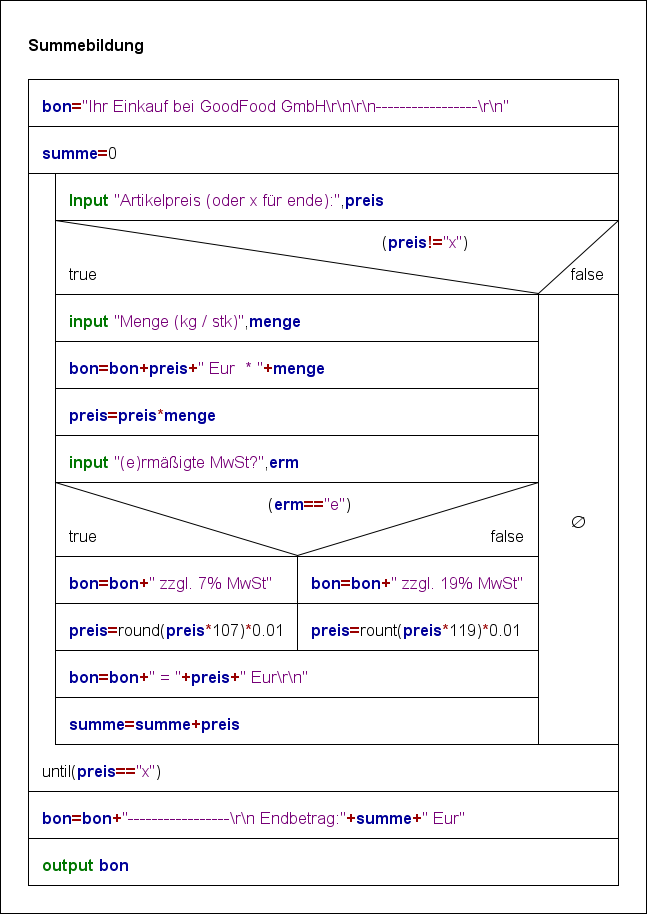

# Lernsituation 3

 **Als erste Funktionalität soll ein Algorithmus entwickelt und implementiert werden, der die Waren aufsummiert. Dabei wird die Ware erfasst und die Menge bestimmt. Einige Waren unterliegen dabei einem reduzierten Mehrwertsteuersatz.**
 
 **Als Auszubildender wirken Sie bei dem Entwurf als auch bei der Implementierung dieses Algorithmus mit. Sie stellen den Entwurf des Algorithmus in Form eines Nassi-Shneiderman-Diagramm dem Entwicklerteam vor und implementieren diesen in Java.**

## Bedingungen

<!--ls3info1-->

> Informieren Sie sich zunächst darüber wie der sequenzielle Programmablauf in unterschiedliche Pfade mittels *Bedingungen* aufgeteilt werden kann und welche Möglichkeiten des zur Realisierung von *Mehrfachverzweigungen* existieren.
>
> Informieren Sie sich ferner darüber wie diese Kontrollstruktur in Form eines Nassi-Shneiderman-Diagramms (Struktogramm) dargestellt werden.

<!--ls3info1-->

### Aufgabe 1

<!--ls3aufgabe1-->
Entwickeln Sie einen Algorithmus, der der Benutzer nach einen Betrag fragt und anschließend, ob auf diesen Betrag der ermäßigte Steuersatz von 7% angewandt werden soll. Anschließend gibt der Algorithmus den Bruttobetrag aus.

Stellen Sie das Programm zunächst in Form eines Struktogramms dar.

**Hinweis:** Nutzen Sie zum Erstellen des Struktogramms das Programm **Structorizer** <https://structorizer.fisch.lu/>) oder den Webdienst **Structog** (<https://dditools.inf.tu-dresden.de/struktog/>).

<!--ls3aufgabe1-->

### Lösung Aufgabe 1

<!--ls3lsg1-->



```java
public class BruttoNetto {
    public static void main(String[] args) {
        float netto;
        float brutto;
        String eingabeMwst;

        Scanner scanner = new Scanner(System.in,"iso-8859-1");
        System.out.print("Nettobetrag in EUR:");
        netto =Float.parseFloat(scanner.nextLine());
        System.out.print("e für ermäßigten Steuersatz:");
        eingabeMwst =scanner.nextLine();
        
        if (eingabeMwst.compareTo("e")==0) {
            brutto=(float) (netto*1.07);
        }
        else {
            brutto=(float) (netto*1.19);
        }
        
        brutto=Math.round(brutto*100);
        brutto=brutto/100;
        System.out.println ("Der Brutto Betrag beträgt "+brutto+" Euro");
        
    }
}
```

<!--ls3lsg1-->

### Übung 1

<!--ls3uebung1-->

**Ein Würfelspiel besitzt folgende Regeln:**

- Wirft der Spieler eine 1, eine 3 oder eine 5 so erhält er die jeweilige Augenzahl als Punkte gutgeschrieben
- Bei einer 2 oder einer 4 erhält er die doppelte Augenzahl als Punkte gutgeschrieben
- Bei einer 6 erhält er 0 Punkte

Entwickeln Sie einen Algorithmus in Form eines Struktogramms, der den Spieler nach der Augenzahl fragt und dann die jeweiligen Punkte ausgibt.

*Hinweis*: Verwenden Sie eine Mehrfachauswahl zur Realisierung des Algorithmus.

<!--ls3uebung1-->


### Lösung Übung 1

<!--ls3lsguebung1-->




```java
import java.util.Scanner;

public class WuSpiel {

    public static void main(String[] args) {
        Scanner s = new Scanner(System.in);
        System.out.print("Was hast Du gewürfelt?");
        int augen = s.nextInt();
        int punkte=0;
        switch (augen) {
            case 2:
            case 4:
                punkte=augen*2;
                break;
            case 6:
                punkte=0;        
                break;
            default:
                punkte=augen;
                break;
        }
        System.out.println("Du erhältst "+punkte+" Punkte!");
    }
    
}
```
<!--ls3lsguebung1-->

## Schleifen

<!--ls3info2-->

> Informieren Sie sich darüber wie Anweisungen mittels wiederholt werden können. Erarbeiten Sie den Unterschied zwischen kopf- und fußgesteuerten Schleifen und die Zählschleife als Sonderform der kopfgesteuerten Schleife. 
>
> Informieren Sie sich darüber wie kopf- und fußgesteuerte Schleifen in Form eines Struktogramms dargestellt werden können.

Diskutieren Sie im Klassenverband die Aussage in dem dargestellten Comic.



### Darstellung im Struktogramm, Programmablaufplan und Pseudocode

Neben der Darstellung von Kontrollstrukturen im Struktogramm existieren noch weitere Notationen um diese darzustellen.

- Programmablaufplan (<https://de.wikipedia.org/wiki/Programmablaufplan>): Hier wird der Kontrollfluss durch Kanten (Linien) dargestellt. Neben Anweisungen gibt es Elemente für Ein- / Ausgaben und Bedingungen.

- Pseudocode (<https://de.wikipedia.org/wiki/Pseudocode> oder bei [LinkedIn](https://www.linkedin.com/learning/grundlagen-der-programmierung-basiswissen/pseudocode-schreiben?u=68522354)): Ist eine Programmiersprachen ähnliche Darstellung eines Algorithmus. Da der Pseudocode keine Blockanweisungen kennt, muss das Ende einer Bedingung durch die Anweisung *Wenn_ende* bzw. bei einer Schleife *Wiederhole_ende* kenntlich gemacht werden.



<!--ls3info2-->

### Übung 2a

<!--ls3uebung2a-->
Entwickeln Sie einen Algorithmus in Form eines Struktogramms der überprüft ob eine eingegeben Zahl eine [Primzahl](http://de.wikipedia.org/wiki/Primzahl) ist.

<!--ls3uebung2a-->


### Lösung Übung 2a

<!--ls3lsguebung2a-->


> Diskutieren Sie ggf. im Klassenverband, wie dieser Algorithmus zu optimieren ist!

<!--ls3lsguebung2a-->

### Übung 2b

<!--ls3uebung2b-->
Implementieren Sie den Algorithmus in Java und überprüfen Sie mit diesem Programm historische Primzahlen aus diesem Wikipedia Artikel <https://de.wikipedia.org/wiki/Primzahl>.

<!--ls3uebung2b-->


### Lösung Übung 2b

<!--ls3lsguebung2b-->
```java
public class PrimzahlenPruefung {
    public static void main(String[] args) {
        Scanner scanner = new Scanner(System.in, "iso-8859-1");
        System.out.print("Zahl:");
        int zahl = Integer.parseInt(scanner.nextLine());
        boolean teilbar=false;
        for (int i=2;i<=zahl-1;i++) {
            if (zahl%i==0) {
                teilbar=true;
            }
        }
        if (teilbar) {
            System.out.println("keine Primzahl");
        }
        else {
            System.out.println("Primzahl");
        }
    }   
}
```
<!--ls3lsguebung2b-->
<!--ls3uebung3-->

### Übung 3

Einwickeln Sie einen Algorithmus in Form von **Pseudocode**, der dem Junge sagt wie alt er ist. Stellen Sie diesen Algorithmus ihren Mitschülern vor.



<!--ls3uebung3-->
<!--ls3lsguebung3-->


### Lösung Übung 3

```txt
Eingabe geb
alter = 2
wiederhole solange geb>0
  p = true
  für i =2 bis alter -1
    wenn alter % i == 0 dann
      p=false
      unterbreche
    wenn_ende
  für_ende
  wenn p == true dann
    geb=geb-1
  alter=alter+1
  wenn_ende
wiederhole_ende
Ausgabe: "Sie sind "+(alter-1)+" Jahre Alt"
```



<!--ls3lsguebung3-->

### Übung 4

<!--ls3uebung4-->
Entwerfen Sie eine Algorithmus in Form von **Pseudocode** der das Restwertverfahren zur Wandlung einer Dezimalzahl in ein anderen Stellenwertsystem implementiert. Einzugeben ist dabei die *Dezimalzahl* und die *Basis* des Zielsystems.

Unten dargestellt ist ist die Wandlung der Dezimalzahl 183 in das Dualzahlensystem (Basis 2).



Stellen Sie ihren Algorithmus ihren Mitschülern vor.

<!--ls3uebung4-->

### Lösung Übung 4

<!--ls3lsguebung4-->

```txt
ausgabe = ""
eingabe zahl
eingabe basis
wiederhole solange zahl>0 
 rest = zahl modulo basis
 ausgabe=rest+ausgabe
 zahl=(zahl-rest)/basis
wiedehole_ende
ausgabe "die gewandelte Zahl lautet"+ausgabe
```

<!--ls3lsguebung4-->

### Aufgabe 2

<!--ls3aufgabe2-->
Für das Kassensystem soll nun ein Algorithmus entwickelt werden, der die Beträge aufsummiert. Ein folgende Auszug enthält das Interview mit der Kassiererin im Markt.

> Wenn der Kunde seine Ware bezahlen will kommt er zur Kasse und legt die Ware auf das Band. Die Preise habe ich soweit im Kopf - ist ja nur ein kleiner Dorfladen. Wenn er also Äpfel kauft, dann weiß ich dass die 1,99€ pro kg kosten und wiege die und trage das in meine Kasse ein. Wir haben natürlich auch Stückware, z.B. Milchflaschen, da gebe ich ein wie viele Flaschen ein Kunde kauft und wie teuer eine Flasche ist.
>
> Zu beachten ist noch, dass einige Waren dem reduzierten Mehrwertsteuersatz unterliegen, dass muss ich dann beachten und statt 19% MwSt nur 7% MwSt auf das Produkt erheben.
>
> Wenn die ganze Ware verbucht wurde nenne ich den Kunden den zu zahlenden Preis und händige im einen Kassenbon aus.

Entwerfen Sie zunächst einen geeigneten Algorithmus in Form eines Struktogramms und implementieren Sie diesen anschließend in JAVA.

<!--ls3aufgabe2-->


### Lösung Aufgabe 2

<!--ls3lsgaufgabe2-->


```java
import java.util.Scanner;

/**
 */
public class Summebildung
{
    
    /**
     * @param args
  */
 public static void main(String[] args)
 {
     
     double summe;
  double menge;
  String bon;

  bon = "Ihr Einkauf bei GoodFood GmbH\r\n\r\n-----------------\r\n";
  summe = 0;
  String eingabe;
  do
  {
      System.out.print("Artikelpreis (oder x für ende):"); eingabe = (new Scanner(System.in)).nextLine();
   if (!eingabe.equals("x"))
   {
       double preis = Double.parseDouble(eingabe);
    System.out.print("Menge (kg / stk)"); 
    menge = (new Scanner(System.in)).nextDouble();
    bon = bon+preis+" Eur  * "+menge;
    preis = preis*menge;
    System.out.print("(e)rmäßigte MwSt?"); 
    String erm = (new Scanner(System.in)).nextLine();
    if (erm.equals("e"))
    {
        bon = bon+" zzgl. 7% MwSt";
     preis = Math.round(preis*107)*0.01;
    }
    else
    {
        bon = bon+" zzgl. 19% MwSt";
     preis = Math.round(preis*119)*0.01;
    }
    bon = bon+" = "+preis+" Eur\r\n";
    summe = summe+preis;
   }
  } while (! ((eingabe.equals("x"))));
  bon = bon+"-----------------\r\n Endbetrag:"+summe+" Eur";
  System.out.println(bon);
 }

}
```

<!--ls3lsgaufgabe2-->

### Aufgabe 3

<!--ls3aufgabe3-->
**Folgender Einkauf wird von einem Kunden durchgeführt:**

- 3 kg Kartoffeln a 1.20€/kg (*) 
- Zwei Milchflaschen a 1.50€/Flasche (*)
- Ein Glas Wiesenhonig a 5.99€/Glas
- 5 Äpfel a 1.50€/kg (*)
- Zwei Flasche Landwein für 4.50€

(*) waren unterliegen dem ermäßigten MwSt Satz von 7%

a) Erstellen Sie mit Hilfe eines Tabellenkalkulationsprogramms eine Tabelle, die den Wert des Warenkorbs bestimmt.

b) Überprüfen Sie mit Hilfe der erstellen Tabelle ihre die Korrektheit Ihres Algorithmus in Form eines **Blackbox Tests**, indem Sie das berechnete *erwartete Verhalten* dem *beobachteten Verhalten* ihres Programms gegenüber stellen. 

<!--ls3aufgabe3-->

### Aufgabe 4

<!--ls3aufgabe4-->
Führen Sie mit ihrem Algorithmus einen **Whitebox Test** durch! Gehen Sie dabei wie folgt vor:

a) Markieren sie *Wege des Kontrollflusses* durch ihren Algorithmus.

b) Setzen Sie einen geeigneten Breakpoint in ihrem Programm und versuchen Sie jeden Weg im Algorithmus zu erreichen. Notieren Sie sich die Eingangsvariablen die dazu nötig waren und die Anweisungen die in diesem Zweig ausgeführt werden!

<!--ls3aufgabe4-->

## Reflexion

<!--ls3reflexion-->
> Diskutieren Sie im Klassenverband wie der Geschäftsprozess weiter zu optimieren werden könnte.

<!--ls3reflexion-->