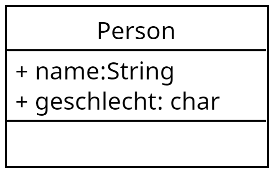

# Lernsituation 4

 **Die Einkäufe (Warenkörbe) sollen im Kassensystem erfasst und als Datei im Computer zur Weiterverarbeitung gespeichert werden.**
 
 **Als Auszubildender wirken Sie bei dem Entwurf als auch bei der Implementierung der notwendigen Datenstruktur und deren Speicherung in Form einer Datei mit und stellen diese dem Entwicklerteam vor.**

## Daten und Klassen

Dinge in der natürlichen Welt setzten sich zumeist aus verschiedenen Datentypen zusammen. So besitzt jede Person einen Namen (*String*) und ein Alter (*byte*). In objektorientierten Programmen werden diese Daten in Form einer Klasse zusammengefasst. 

```java
public class Person {
    String name;
    int age;
}
```

Zur Darstellung dieser Daten dient das Klassendiagramm als grafische Notation.



Zu beachten ist hier, dass die Notation lautet **Name des Attributs:Datentyp**.

### Aufgabe 1

In unserem Kassensystem werden Waren, deren Preis, Mengen und der MwSt.-Satz gespeichert. Erstellen Sie für das Kassensystem ein geeignetes Klassendiagramm für eine **Postition** (auf dem Bon) und implementieren Sie diese Datenstruktur in JAVA.

### Lösung Aufgabe 1


```java
public class Position {
    String bezeichnung;
    double preis;
    double menge;
    boolean reduziert;
}
```

## Beziehungen zwischen Klassen ("ist Teil von Beziehung")

Dinge in der realen Welt bestehen nicht nur aus einer Ansammlung von primitiven Datentypen, sondern sie stehen auch in einer Beziehung zu anderen Dingen.

So besteht ein Datum, z.B. aus den primitiven Daten Tag, Monat und Jahr und kann als Klassendiagramm wie folgt dargestellt werden.


```java
public class Datum {
    byte tag;
    byte monat;
    short jahr;
}
```

Die zuvor beschriebene Person mit einem Namen und einem Alter, besitzt natürlich auch ein Geburtsdatum (aus dem man dann das Alter bestimmen, wodurch das alter redundant wird und weggelassen werden kann). Im Klassendiagramm kann dieser Sachverhalt wie folgt dargestellt werden.


Im Java Code würde das wie folgt aussehen

```java
public class Person {
    String name;
    geb Datum;
}
```

### Aufgabe 2

Untersuchen Sie die Daten auf einem Einkaufzettel und stellen Sie diese Daten in Form eins Klassendiagramms dar. Fassen Sie dabei möglichst viele Daten zu Klassen (Dinge) zusammen. Vernachlässigen Sie dabei die gekauften Positionen. 

Stellen Sie im Anschluss daran ihre Lösung der Klasse vor und diskutieren Sie im Klassenverband Vor- und Nachteile der einzelnen Lösungen.

### Lösung Aufgabe 2


## Beziehungen zwischen Klassen ("ist so etwas wie Beziehung")

