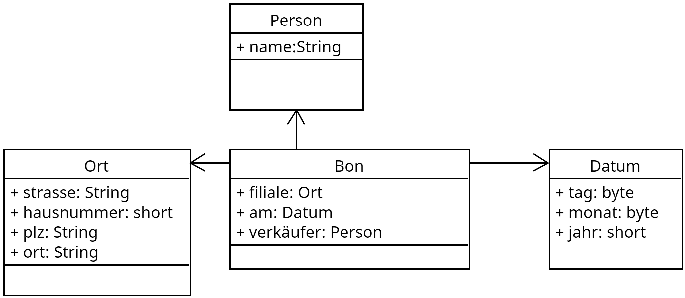
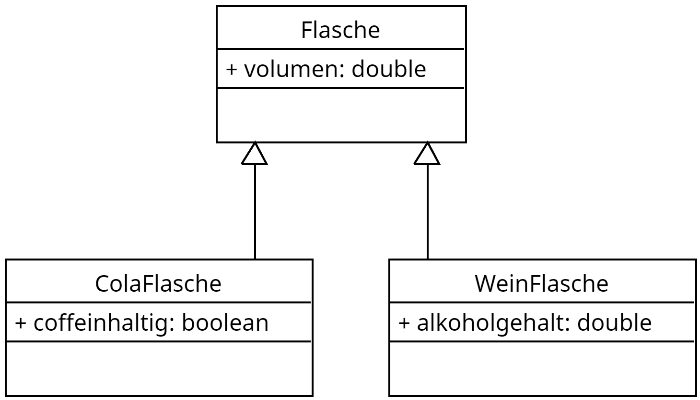

# Lernsituation 4

 **Die Einkäufe (Warenkörbe) sollen im Kassensystem erfasst und als Datei im Computer zur Weiterverarbeitung gespeichert werden.**
 
 **Als Auszubildender wirken Sie bei dem Entwurf als auch bei der Implementierung der notwendigen Datenstruktur und deren Speicherung in Form einer Datei mit und stellen diese dem Entwicklerteam vor.**

<!--ls4aufgabe1-->
## Daten und Klassen

Dinge in der natürlichen Welt setzten sich zumeist aus verschiedenen primitiven Datentypen zusammen. So besitzt jede Person einen Namen (*String*) und ein Geschlecht 'm','w','d'  (*char*). In objektorientierten Programmen werden diese Daten in Form einer Klasse zusammengefasst. 

```java
public class Person {
    public String name;
    public char geschlecht;
}
```

Zur Darstellung dieser Daten dient das Klassendiagramm als grafische Notation.

{ width=200px }

Zu beachten ist hier, dass die Notation für die Eigenschaften (**Attribute**) lautet:

> **Name des Attributs:Datentyp**.

### Aufgabe 1

In unserem Kassensystem werden Waren, deren Preis, Mengen und der MwSt.-Satz (reduziert oder nicht reduziert) gespeichert. Erstellen Sie für das Kassensystem ein geeignetes Klassendiagramm für eine **Postition** (auf dem Bon) und implementieren Sie diese Datenstruktur in JAVA.

<!--ls4aufgabe1-->
### Lösung Aufgabe 1
<!--ls4lsgaufgabe1-->

{ width=200px }

```java
public class Position {
    public String bezeichnung;
    public double preis;
    public double menge;
    public boolean reduziert;
}
```
<!--ls4lsgaufgabe1-->
<!--ls4uebung1-->

## Beziehungen zwischen Klassen ("ist Teil von Beziehung")

Dinge in der realen Welt bestehen nicht nur aus einer Ansammlung von primitiven Datentypen, sondern sie stehen auch in einer Beziehung zu anderen Dingen.

So besteht ein Datum, z.B. aus den primitiven Daten Tag, Monat und Jahr und kann als Klassendiagramm wie folgt dargestellt werden.

{ width=200px }

```java
public class Datum {
    public byte tag;
    public byte monat;
    public short jahr;
}
```

Die zuvor beschriebene Person mit einem Namen und einem Geschlecht, besitzt natürlich auch ein Geburtsdatum. Im Klassendiagramm kann dieser Sachverhalt wie folgt dargestellt werden.

{ width=400px }

Im Java Code würde das wie folgt aussehen

```java
public class Person {
    public String name;
    public char geschlecht;
    public Datum geb;
}
```

### Übung 1

Auch ihre Schulklasse besteht aus vielen Daten, die in einer Beziehung zueinander stehen (die Schüler der Klasse mal vernachlässigt). So besitzt ihr Schulklasse:

- eine Bezeichnung
- einen Klassenlehrer
- ein Einschulungsdatum
- einen Ausbildungsberuf
- und ggf. noch mehr

Erstellen Sie einer Klassendiagramm der Schulklasse, wobei möglichst viele "Dinge" in einzelnen Klassen zusammengefasst werden.

<!--ls4uebung1-->
<!--ls4lsguebung1-->
### Lösung Übung 1

{ width=600px }

<!--ls4lsguebung1-->
### Aufgabe 2
<!--ls4aufgabe2-->

Untersuchen Sie die Daten auf einem Kassenbeleg (Bon) und stellen Sie diese Daten in Form eins Klassendiagramms dar. Fassen Sie dabei möglichst viele Daten zu Klassen (Dinge) zusammen. Vernachlässigen Sie dabei die gekauften Positionen. 

Stellen Sie im Anschluss daran ihre Lösung der Klasse vor und diskutieren Sie im Klassenverband Vor- und Nachteile der einzelnen Lösungen.

<!--ls4aufgabe2-->
### Lösung Aufgabe 2
<!--ls4lsgaufgabe2-->

{ width=500px }
<!--ls4lsgaufgabe2-->
<!--ls4uebung2-->

## Beziehungen zwischen Klassen ("ist so etwas wie Beziehung")

Dinge in der objektorientierten Welt haben jedoch nicht nur eine "ist Teil von" Beziehung, sondern ähneln einander im Sinne von einer "ist so etwas wie" Beziehung. So hat eine Flasche eine Füllmenge. Eine Cola Flasche ist dabei so etwas wie eine Flasche enthält aber ein coffeinhaltiges Getränk. Auch eine Weinflasche ist eine Flasche enthält aber ein alkoholisches Getränk mit einem alkoholgehalt. Im Klassendiagramm wird dieser Zusammenhang wie folgt dargestellt.

{ width=400px }

Dabei bezeichnet man die allgemeine Klasse als **Elternklasse** und die konkreteren (spezialisierteren) Klassen als **Kindklasse**. Bei dieser Art von Beziehung gehen alle Attribute der Elternklasse auf die Kindklasse über, daher wird dieses auch als **Vererbung** bezeichnet. D.h. auch die Weinflasche besitzt ein *Volumen* hat aber zusätzlich das Attribut *Alkoholgehalt*.

Im Java code wird die "ist so was wie" Beziehung durch das Schlüsselwort **extends** beschrieben. So kann man den obigen Zusammenhang in Java wie folgt ausdrücken.

```java
public class WeinFlasche extends Flasche {
    public double alkoholgehalt;
}
```

### Übung 2

>Jede Person besitzt einen Namen und ein Geschlecht. Erwachsene sind Personen, die über einen Familienstand verfügen. Ein Lehrer ist ein Erwachsener, der ein Kürzel hat. Auch ein Student ist ein Erwachsener, der über eine Matrikelnummer verfügt. Ein Kind ist eine Person und hat ein Lieblingsspiel. Ein Schulkind geht darüber hinaus noch zu einer Schule. Ein Koordinator einer Schule ist ein Lehrer der einen Abteilung leitet. Der Schulleiter einer Schule ist Lehrer, leitet aber eine ganze Schule. Ein Austauschstudent ist ein Student, der eine Gastuniversität hat.

Stellen Sie diesen Zusammenhang im Klassendiagramm dar.

<!--ls4uebung2-->
### Lösung Übung 2
<!--ls4lsguebung2-->

{ width=600px }

<!--ls4lsguebung2-->
### Aufgabe 3
<!--ls4aufgabe3-->

Auch in dem Kassensystem für die GoodFood GmbH treten Dinge in eine "ist so etwas wie" Beziehung auf. So gibt es in dem Ladengeschäft Produkte und LoseProdukte. Jedes Produkt hat dabei einen Namen, einen Preis und einen Mehrwertsteuersatz. Bei einem losen Produkt (wie Kartoffeln, Äpfel etc.) muss jedoch noch das Gewicht mit berücksichtigt werden.

Stellen Sie diesen Zusammenhang in Form eines Klassendiagramms dar und implementieren Sie die Klasse Produkt und LosesProdukt in Java.
<!--ls4aufgabe3-->

### Lösung Aufgabe 3
<!--ls4lsgaufgabe3-->

{ width=200px }

```java

public class Produkt {
    public String bezeichnung;
    public double preis;
    public double mwst;
}

public class LosesProdukt extends Produkt{
    public double gewicht;
}

```
<!--ls4lsgaufgabe3-->

<!--ls4aufgabe4-->

## Objekte erzeugen und Attribute zuweisen

Bisher haben wir lediglich Baupläne (Klassen) für Dinge erzeugt, aber noch keine Dinge (Objekte). Um aus Klassen Objekte zu erzeugen müssen konkrete Instanzen erzeugt werden. In Java geschieht dieses über der **new** Anweisung. Die Objekte werden dabei in Variablen gespeichert, deren Typ der Name der Klasse ist. 

```java
public class Main {
    public static void main(String[] args) {
        Person p1=new Person();
        Person p2=new Person();
    }
}
```

{ width=400px }

In dem oben gezeigten Java Code werden zwei Objekte **p1** und **p2** vom Typ Person erzeugt. Um auf die Einzelnen Attribute eines Objektes zugreifen zu können werden diese über **{Objektname}.{Eigenschaft}** angesprochen in unserem Fall können wird z.B. der Person **p1** den Namen "Max Mustermann" und das Geburtsdatum 1.5.1995 wie folgt zuweisen.

```java
public class Main {
    public static void main(String[] args) {
        Person p1=new Person();
        Person p2=new Person();
        p1.name="Max Mustermann";
        p1.geb.tag=1;
        p1.geb.monat=5;
        p1.geb.jahr=1995;
    }
}
```

### Aufgabe 4

Im Laden der GoodFood GmbH an der Hauptstraße 32, 30167 Hannover wird durch den Verkäufe "Max Mustermann" am 17.3.2024 ein Einkauf getätigt. Erzeugen Sie das entsprechende *Bon* Objekt.

{ width=500px }

> **Hinweis**: Die entsprechenden Klassen sind im Repository <https://github.com/jtuttas/LF5-schueler> im Ordner shop/src/main/java/de/obj bereits enthalten!

```java
public class Bon {
    public Ort filiale = new Ort();
    public Datum am = new Datum();
    public Person verkäufer = new Person();
}

public class Ort {
    public String strasse;
    public short hausnummer;
    public String plz;
    public String ort;
}

public class Person {
    public String name;
}

public class Datum {
    public byte tag;
    public byte monat;
    public short jahr;
}
```
<!--ls4aufgabe4-->

### Lösung Aufgabe 4
<!--ls4lsgaufgabe4-->

```java
public class Main {
    public static void main(String[] args) {
        Bon b = new Bon();
        b.filiale.strasse="Hauptstrasse";
        b.filiale.hausnummer=32;
        b.filiale.plz="30167";
        b.filiale.ort="Hannover";
        b.verkäufer.name="Max Mustermann";
        b.am.tag=17;
        b.am.monat=3;
        b.am.jahr=2024;
    }
}
```
<!--ls4lsgaufgabe4-->

<!--ls4uebung3-->

## Felder von Daten

Daten in Form von Objekten werden treten oft als Felder auf, so z.B. die einzelnen Schüler der Klasse, die Noten auf einem Zeugnis etc.. Diese Daten werden in einem Feldobjekt (**Array**) bzw. dynamischer in einer **ArrayList** gespeichert. 

Informieren Sie sich wie in Java Arrays und ArrayLists deklariert werden und wie Sie auf die einzelnen Daten eines Feldes zugreifen können.

Im Klassendiagramm sind die Felder einzelne Attribute, die Beziehung zwischen den enthaltenen Elemente weist nun jedoch eine Nummerierung (**Kardinalität**) auf.

{ width=500px }

```java
public class Zeugnis {
    public Person person;
    public Beruf beruf;
    public ArrayList<Note> noten = new ArrayList();
}
```

### Übung 3

In der Übung 2 haben wir das Klassendiagramm für eine Schulklasse entworfen.

{ width=500px }

Erweitern Sie das Klassendiagramm um eine ArrayList mit dem Namen *Schüler*, jeder Schüler sollte dabei einen Namen und ein Geschlecht besitzen.

<!--ls4uebung3-->
### Lösung Übung 3
<!--ls4lsguebung3-->

{ width=600px }

<!--ls4lsguebung3-->
### Aufgabe 5
<!--ls4aufgabe5-->

Auf dem zuvor entworfenen Klassendiagramm für den Kassenbon sollen nun auch die Waren in Form Positionen erfasst werden.

{ width=500px }

Jede Position besteht aus einem Produkt bzw. Artikel und der gekauften Menge. Ein Produkt (Artikel) besitzt einen Namen, einen Preis und einen Mehrwertsteuersatz. Erweitern Sie das Klassendiagramm in geeigneter Weise.

<!--ls4aufgabe5-->
### Lösung Aufgabe 5
<!--ls4lsgaufgabe5-->

{ width=500px }

<!--ls4lsgaufgabe5-->
### Aufgabe 6
<!--ls4aufgabe6-->

Dem in Aufgabe 4 erzeugten Bon sollen nun folgende Positionen hinzugefügt werden.

- 3 kg Kartoffeln a 1.20€/kg (*)
- Ein Glas Wiesenhonig a 5.99€/Glas

(*) Waren unterliegen dem ermäßigten MwSt Satz von 7%

Fügen Sie diese Objekte dem Warenkorb hinzu.

> **Hinweis**: Die entsprechenden Klassen sind im Repository <https://github.com/jtuttas/LF5-schueler> im Ordner shop/src/main/java/de/obj bereits enthalten!

<!--ls4aufgabe6-->
### Lösung Aufgabe 6
<!--ls4lsgaufgabe6-->

```java
public class Main {
    public static void main(String[] args) {
        Bon b = new Bon();
        b.filiale.strasse="Hauptstrasse";
        b.filiale.hausnummer=32;
        b.filiale.plz="30167";
        b.filiale.ort="Hannover";
        b.verkäufer.name="Max Mustermann";
        b.am.tag=17;
        b.am.monat=3;
        b.am.jahr=2024;

        // Aufgabe 6
        Produkt p1 = new Produkt();
        p1.bezeichnung="Kartoffeln";
        p1.mwst=0.07f;
        p1.preis=1.20;
        Artikel a1 = new Artikel();
        a1.produkt=p1;
        a1.menge=3;
        b.position.add(a1);

        Produkt p2 = new Produkt();
        p2.bezeichnung="Wiesenhonig";
        p2.mwst=0.19f;
        p2.preis=5.99;
        Artikel a2 = new Artikel();
        a2.produkt=p2;
        a2.menge=1;
        b.position.add(a2);

    }
}
```
<!--ls4lsgaufgabe6-->

<!--ls4aufgabe7-->

## Iterationsschleife "for each"

Oftmals ist es notwendig alle Elemente eines Feldes wir ein Array oder eine ArrayList auszulesen, um diese Elemente ggf. zu bearbeiten. Geschehen kann dieses natürlich wie folgt mit einer Zählschleife.

```java
public static void main(String[] args) {
    String[] namen = {"Thomas","Frank","Simone","Oliver"};

    for (int i=0;i<namen.length;i++) {
        System.out.println(namen[i]);
    }
}
```

Einfacher zu realisieren ist dieses jedoch mitteln einer **for-each** Schleife.

```java
public static void main(String[] args) {
    String[] namen = {"Thomas","Frank","Simone","Oliver"};

    for (String name : namen) {
        System.out.println(name);            
    }
}
```

Dabei nimmt die Variable *name* alle Werte in dem Array an. Es entfällt die Indexvariable **i**, die Abfrage der Größe des Arrays, die Indizierung der Elemente.

### Aufgabe 7

Erweitern Sie ihr Programm aus der vorherigen Aufgabe und geben Sie alle Positionen auf dem erzeugten Bon auf der Konsole aus !

<!--ls4aufgabe7-->
### Lösung Aufgabe 7
<!--ls4lsgaufgabe7-->

```java
for (Artikel a : b.position) {
    System.out.println(a);
}
```

<!--ls4lsgaufgabe7-->
<!--ls4uebung4-->
## Speicherung von Objekten

Die Daten eines Bons sollen im Dateisystem des PCs zur weiteren Verarbeitung gespeichert werden. Dabei soll das Dateiformat sowohl maschinenlesbar als auch vom Menschen lesbar sein. Geeignet für diese Anforderung sind unterschiedliche Formate wie **csv**,**xml** und **json**. 

Betrachten wir dazu eine einfache Datenstruktur in Form eines Arrays, die Personen einer Gruppe speichert.

{ width=400px }

Der Gruppe mit der Bezeichnung "Sportverein" sollen folgende Personen angehören:

- Max Mustermann (m)
- Simone Musterfrau (w)

#### Die **CSV** Darstellung dieser Gruppe würde wie folgt aussehen

```csv
"bezeichnung";"name";"geschlecht"
"Sportverein";"Max Mustermann";"m"
"Sportverein";"Simone Musterfrau";"w"
```

#### Die Darstellung als **XML** würde wie folgt aussehen

```xml
<Gruppe>
    <Bezeichnung>Sportverein</Bezeichnung>
    <Person>
        <name>Max Mustermann</name>
        <geschlecht>m</geschlecht>
    </Person>
    <Person>
        <name>Simone Musterfrau</name>
        <geschlecht>w</geschlecht>
    </Person>
</Gruppe>
```

#### Als **JSON** würde die Darstellung wie folgt aussehen

```json
{
  "Gruppe": {
    "Bezeichnung": "Sportverein",
    "Person": [
        {
            "name": "Max Mustermann",
        "geschlecht": "m"
      },
      {
        "name": "Simone Musterfrau",
        "geschlecht": "w"
      }
    ]
  }
}
```

### Übung 4

Eine Schulklasse hat eine *Bezeichnung*, einen *Klassenlehrer* (mit Namen, einem Kürzel und dem Merkmal freundlich / nicht freundlich) und besteht aus wenigstens drei *Schülern* mit Namen und Geschlecht.

Wählen Sie eine Form der Darstellung: 

- als CSV Datei
- als XML Datei
- als JSON Datei

und stellen Sie die Schulklasse in Form der gewählten Datei dar.

<!--ls4uebung4-->
### Aufgabe 8
<!--ls4aufgabe8-->

Der Bon des Kassensystem soll in Form einer **JSON** Datei gespeichert werden.

{ width=500px }

Dabei soll von folgenden Daten ausgegangen werden. 

> Im Laden der GoodFood GmbH an der Hauptstraße 32, 30167 Hannover wird durch den Verkäufe "Max Mustermann" am 17.3.2024 ein Einkauf getätigt. Gekauft wird:
>
>- 3 kg Kartoffeln a 1.20€/kg (*)
>- Ein Glas Wiesenhonig a 5.99€/Glas

Erstellen Sie die entsprechende JSON Darstellung des Bons.
<!--ls4aufgabe8-->

## Fragen zum Verständnis

### Was ist der Hauptzweck der Klassendiagramme in der objektorientierten Programmierung?

- [ ] A) Um die Benutzeroberfläche einer Anwendung zu entwerfen.
- [ ] B) Um den Ablauf von Programmen darzustellen.
- [ ] C) Um die Struktur von Klassen und ihre Beziehungen zueinander zu visualisieren.
- [ ] D) Um die Netzwerkarchitektur eines Systems zu illustrieren.

### Was bedeutet "Vererbung" in der objektorientierten Programmierung?

- [ ] A) Das Übertragen von Daten von einer Datenbank auf eine andere.
- [ ] B) Das Kopieren von Methoden innerhalb einer Klasse.
- [ ] C) Das Weitergeben von Eigenschaften und Methoden einer Klasse (Elternklasse) an eine andere Klasse (Kindklasse).
- [ ] D) Die Speicherung von Daten in einer Datei.

### Was kennzeichnet eine "for-each" Schleife im Vergleich zu einer herkömmlichen "for" Schleife?

- [ ] A) Sie kann nur für numerische Arrays verwendet werden.
- [ ] B) Sie vereinfacht das Durchlaufen von Sammlungen, indem sie direkt auf die Elemente zugreift, ohne einen Index zu verwenden.
- [ ] C) Sie ist langsamer und weniger effizient als eine normale "for" Schleife.
- [ ] D) Sie kann nur auf Listen und nicht auf Arrays angewendet werden.

### Wofür wird das Schlüsselwort `extends` in Java verwendet?

- [ ] A) Um eine neue Klasse zu erstellen.
- [ ] B) Um eine Methode in einer Klasse zu definieren.
- [ ] C) Um eine Klasse zu kennzeichnen, die von einer anderen Klasse erbt.
- [ ] D) Um eine Schnittstelle zu implementieren.

### In einem Klassendiagramm, was stellt eine Assoziation zwischen zwei Klassen dar?

- [ ] A) Eine Vererbungsbeziehung.
- [ ] B) Eine Abhängigkeit zwischen Methoden.
- [ ] C) Eine Beziehung, in der eine Klasse ein Attribut oder ein Verhalten der anderen Klasse verwendet.
- [ ] D) Eine parallele Ausführung von Klassen.

### Was ist der Unterschied zwischen einem Array und einer ArrayList in Java?

- [ ] A) Ein Array kann nur primitive Datentypen speichern, während eine ArrayList Objekte speichern kann.
- [ ] B) Ein Array hat eine feste Größe, während eine ArrayList dynamisch wachsen oder schrumpfen kann.
- [ ] C) Ein Array ist schneller als eine ArrayList.
- [ ] D) Eine ArrayList kann nur numerische Werte speichern.

### Was kennzeichnet das CSV-Format im Vergleich zu JSON und XML?

- [ ] A) Es unterstützt die Verschachtelung von Daten.
- [ ] B) Es wird hauptsächlich für den Austausch von Daten zwischen verschiedenen Programmen verwendet.
- [ ] C) Es ist besonders geeignet für tabellarische Daten ohne komplexe Hierarchien.
- [ ] D) Es verwendet Tags zur Darstellung von Datenstrukturen.
