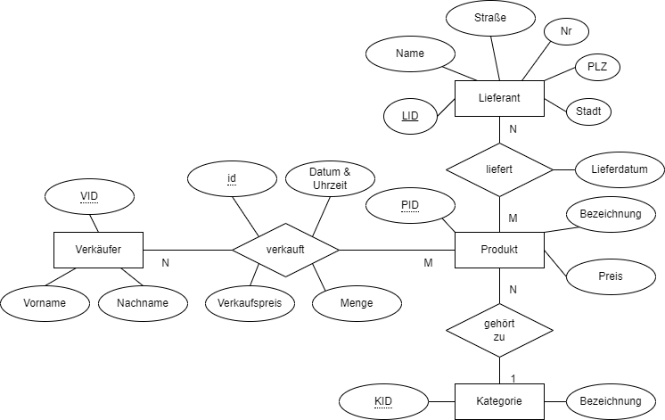

# Lernsituation 5

 **Die Umsätze der GoodFood GmbH sollen zur späteren Auswertung dauerhaft (persistent) in einer Datenbank gespeichert werden.**
 
 **Als Auszubildender wirken Sie bei dem Entwurf der Datenbank mit und erstellen erste exemplarische SQL Abfragen für diese Datenbank.**

<!--ls5aufg1a-->
## Entitäten und deren Beziehungen

### Entitäten

 Daten werden in einer relationalen Datenbank in Form von Tabellen zusammengefasst. Jede Tabelle beschreibt dabei ein "Ding" eine **Entität**. Die Spalten der Tabelle sind die einzelnen **Attribute** und eine Zeile einer Tabelle entspricht einem **Datensatz**.

 So sind z.B. die Daten der Schüler in der Schulverwaltung in einer Tabelle zusammengefasst. Denkbar wäre z.B. folgende Tabellenstruktur.

| ID  | Vorname  | Nachname     | Geburtsdatum   | Straße        | Hausnummer | PLZ    | Ort          |
|-----|----------|--------------|----------------|---------------|------------|--------|--------------|
| 1   | Max      | Mustermann   | 2007-04-15     | Hauptstraße   | 5          | 12345  | Musterstadt  |
| 2   | Emma     | Beispiel     | 2006-08-09     | Blumenweg     | 12         | 23456  | Blumenhausen |
| 3   | Leon     | Bauer        | 2008-01-22     | Wiesenring    | 3          | 34567  | Grünfeld     |
| 4   | Mia      | Handwerk     | 2006-03-03     | Bergpfad      | 8          | 45678  | Steinbruch   |
| 5   | Tim      | Schneider    | 2007-11-27     | Sonnenallee   | 44         | 56789  | Lichterstadt |

Dabei wird jeder Datensatz über einen eindeutigen Schlüssel, den **Primärschlüssel** (zumiest eine fortlaufende Zahl) identifiziert.

Im Entity Relation Diagramm (**ER Diagramm**) werden diese Daten wie folgt dargestellt.

{ width=350px }

**Wichtig**: Man beachte das der Primärschlüssel **ID** unterstrichen dargestellt wird.

### Beziehungen von Entitäten (1:N - Eins zu viele Beziehung)

In ähnlicher Weise wir Klassen in der objektorientierten Programmierung in einer Beziehung, stehen auch Entitäten einer Datenbank in Beziehungen zueinander. So ist in der Schulverwaltung sicherlich eine Entität *SchulKlasse* enthalten, mit z.B. folgenden Inhalten:

| ID  | Bezeichnung | Ausbildungsberuf |
| --- | ----------- | ---------------- |
| 1   | FIAE23J     | Fachinformatiker Anwendungsentwicklung              |
| 2   | FIAE23K     | Fachinformatiker Anwendungsentwicklung              |
| 3   | FISI23A     | Fachinformatiker Systemintegration              |

Die Schüler der Schule sind dabei den Klassen zugewiesen, in der Weise, dass stets ein Schüler einer Klasse zugewiesen wird und jede Klasse aus mehreren Schülern besteht. Man spricht in diesem Zusammenhang von einer **1:N** Beziehung. In der Tabelle wird dazu ein **Fremdschlüssel** hinzugefügt, der auf den Primärschlüssel der Klasse verweist.

| ID  | Vorname | Nachname   | Geburtsdatum | Straße      | Hausnummer | PLZ   | Ort          | Klasse |
| --- | ------- | ---------- | ------------ | ----------- | ---------- | ----- | ------------ | ------ |
| 1   | Max     | Mustermann | 2007-04-15   | Hauptstraße | 5          | 12345 | Musterstadt  |  1      |
| 2   | Emma    | Beispiel   | 2006-08-09   | Blumenweg   | 12         | 23456 | Blumenhausen |   1     |
| 3   | Leon    | Bauer      | 2008-01-22   | Wiesenring  | 3          | 34567 | Grünfeld     |    1    |
| 4   | Mia     | Handwerk   | 2006-03-03   | Bergpfad    | 8          | 45678 | Steinbruch   |    2    |
| 5   | Tim     | Schneider  | 2007-11-27   | Sonnenallee | 44         | 56789 | Lichterstadt |     3   |

So befindet sich Max Mustermann, Emma Beispiel und Leon Bauer in der Klasse FIAE23J, wohingegen Mia Handwerk sich in der FIAE23K und Tim Schneider in der FISI23A befinden.

Im ER Diagramm wird diese Beziehung durch eine Raute dargestellt, die die beiden Entitäten Klasse und Schüler verbindet.

{ width=500px }

#### Aufgabe 1a

Die Produkte der GoodFood GmbH besitzen unterschiedliche Kategorien, wie z.B.

- Gemüse
- Obst
- Getränke
- Milchprodukt
- Backwaren
- Fleisch und Wurstwaren

Entwerfen Sie eine Datenbank in Form eines ER Diagramms, für die Produkte und deren Kategorien für die GoodFood GmbH. Weisen Sie dem Produkt mindestens 3 Attribute zu.

<!--ls5aufg1a-->
#### Lösung Aufgabe 1a
<!--ls5lsgaufg1a-->

Möglich Lösung für die Beziehung *Produkt* und *Kategorie*.

{ width=500px }

<!--ls5lsgaufg1a-->
#### Aufgabe 1b
<!--ls5aufg1b-->

Für die Beziehung Produkt - Kategorie soll folgendes ER Diagramm verwendet werden:

{ width=500px }

Erstellen Sie mit Hilfe eines Tabellenkalkulationsprogramms die zuvor entworfene Datenbank. Die Datenbank sollte dabei wenigstens 4 Produkte und 3 Kategorien beinhalten.

<!--ls5aufg1b-->
#### Lösung Aufgabe 1b
<!--ls5lsgaufg1b-->

##### Produkte Tabelle

| PID | Name           | BioZertifizierung | Saison     | KategorieID |
| --- | -------------- | ----------------- | ---------- | ----------- |
| 1   | Frischer Salat | Ja                | Sommer     | 1           |
| 2   | Äpfel          | Nein              | Herbst     | 2           |
| 3   | Mineralwasser  | Ja                | Ganzjährig | 3           |
| 4   | Bergkäse       | Ja                | Winter     | 4           |
| 5   | Radieschen     | Nein              | Frühling   | 1           |
| 6   | Butter         | nein              | Ganzjährig | 4           |

##### Kategorien Tabelle

| KID | Bezeichnung  |
|-------------|------------|
| 1           | Gemüse     |
| 2           | Obst       |
| 3           | Getränke   |
| 4           | Milchprodukt|

<!--ls5lsgaufg1b-->
<!--ls5aufg2a-->

### Beziehungen von Entitäten (N:M - Viele zu viele Beziehung)

Neben der **1:N** Beziehung existiert oft auch eine **N:M** Beziehung auch als *Viele zu Viele Beziehung* bezeichnet. So existieren in unsere Schule viele Lehrer. Auch die Lehrer sind in der Schulverwaltung erfasst, z.B. in folgender Tabelle:

| LID | Name             | Kürzel |
|----|------------------|--------|
| 1  | Jörg Tuttas      | TU     |
| 2  | Bernd Schmitz    | BS     |
| 3  | Claudia Vogt     | CV     |
| 4  | Daniel Fuchs     | DF     |
| 5  | Elisabeth Becker | EB     |

Jeder Lehrer unterrichtet dabei mehrere Klassen, dabei wird jedoch auch eine Klasse von mehreren Lehrern unterrichtet. Die Entitäten *Lehrer* und *Klasse* stehen also in einer **N:M** Beziehung. Im ER Diagramm wird dieses wie folgt dargestellt.

{ width=500px }

Um diesen Sachverhalt in einer Relationalen Datenbank abzubilden muss eine weitere Tabelle erzeugt werden, eine **Relationstabelle**. Diese **Relationstabelle** besteht zumindest aus den **Primärschlüsseln** der beiden zu verbindenden Entitäten (in diesem Beispiel *Lehrer* und *Klasse*).

#### Tabelle Klasse

| KID  | Bezeichnung | Ausbildungsberuf |
| --- | ----------- | ---------------- |
| 1   | FIAE23J     | Fachinformatiker Anwendungsentwicklung              |
| 2   | FIAE23K     | Fachinformatiker Anwendungsentwicklung              |
| 3   | FISI23A     | Fachinformatiker Systemintegration              |

##### Relationstabelle

| LID | KID |
| --- | --- |
| 1   | 1   |
| 1   | 2   |
| 2   | 1   |
| 4   | 1   |
| 2   | 3   |

In diesem Beispiel würde somit der Lehrer "Jörg Tuttas", die Klasse FIAE23J und die Klasse FIAE23K unterrichten. Und die Klasse FIAE23K hätte Unterricht bei "Jörg Tuttas", "Bernd Schmitz" und "Daniel Fuchs".

#### Aufgabe 2a

Die GoodFood GmbH erhält Produkte von diversen regionalen Zuliefern. Erstellen Sie ein ER Diagramm welches diesen Zusammenhang darstellt. Jede Entität der Beziehung sollte wenigstens über 3 Attribute verfügen.
<!--ls5aufg2a-->

##### Lösung Aufgabe 2a
<!--ls5lsgaufg2a-->

Möglich Lösung für die Beziehung der Entitäten *Produkt* und *Lieferant*.

{ width=500px }
<!--ls5lsgaufg2a-->

#### Aufgabe 2b
<!--ls5aufg2b-->

Es gilt folgendes ER-Diagramm:

{ width=500px }

Erstellen Sie mit Hilfe einer Tabellenkalkulation dir notwendigen Tabellen zur Abbildung dieser Beziehung. Dabei sollte die Tabelle wenigstens 5 Produkt und drei Lieferanten beinhalten.
<!--ls5aufg2b-->

#### Lösung Aufgabe 2b
<!--ls5lsgaufg2b-->

##### Tabelle "Produkt"

| PID | Name           | BioZertifizierung | Saison     | KategorieID |
| --- | -------------- | ----------------- | ---------- | ----------- |
| 1   | Frischer Salat | Ja                | Sommer     | 1           |
| 2   | Äpfel          | Nein              | Herbst     | 2           |
| 3   | Mineralwasser  | Ja                | Ganzjährig | 3           |
| 4   | Bergkäse       | Ja                | Winter     | 4           |
| 5   | Radieschen     | Nein              | Frühling   | 1           |
| 6   | Butter         | nein              | Ganzjährig | 4           |

##### Tabelle "Lieferant"

| LID | Name                 | Straße       | Nr  | Stadt      | PLZ   |
| --- | -------------------- | ------------ | --- | ---------- | ----- |
| 1   | Bio Hof Peter Lustig | Grüne Straße | 1   | Hannover   | 30539 |
| 2   | Bauer Eder           | Nebenstraße  | 2   | Hannover   | 30167 |
| 3   | Milchbauer Ludwig    | Seitenstraße | 12  | Hildesheim | 31141 |

##### Tabelle "liefert"

| LID | PID |
| --- | --- |
| 1   | 1   |
| 1   | 2   |
| 1   | 5   |
| 2   | 1   |
| 2   | 6   |
| 3   | 4   |
| 3   | 6   |

<!--ls5lsgaufg2b-->

<!--ls5uebung2-->
## Structured Query Language (SQL)

Die Structured Query Language (**SQL**) ist eine Abfragesprache für relationale Datenbanken. Die Abfragen werden mittels der **SELECT** Anweisung durchgeführt. Nachdem mittels eine Client die Verbindung zur Datenbank aufgebaut wurde, können die SQL Befehle abgeschickt werden.

> **Hinweis**: Es wurde sich dafür entschieden als Datenbankmanagement System **SQLite** zu verwenden. **SQLite** Datenbanken sind dabei einfache dateibasierte Datenbanken. Für dieses System existieren eine Vielzahl von Client z.B. <https://sqlitestudio.pl/>
 oder auch als VS Code Plugin <https://marketplace.visualstudio.com/items?itemName=alexcvzz.vscode-sqlite>. Entschieden Sie sich für einen geeigneten Client und installieren diesen.

Der Aufbau der **SELECT** Anweisung ist in der folgenden Grafik dargestellt. 


Die Datenbank für das Kassensystem der GoodFood GmbH besteht aktuell aus vier Entitäten (Produkt, Verkäufer, Lieferant und Kategorie) und befindet sich im Ordner **shop** des Repositories. Die Datenbank hat dabei folgenden Struktur:

{ width=700px }

### Übung 1

Verbinden Sie sich mit der Datenbank, indem Sie die Datei **shop.db** mit einem SQLite Client öffnen. Führen Sie im Anschluss daran folgenden SQL Befehl aus:

```sql
SELECT * from Produkt;
```

Im Anschluss daran müssten Sie alle alle Produkte des Geschäfts aufgelistet sehen. Ändern Sie ihre SQL Anweisung dahingegen, dass die Produkte alphabetische sortiert nach den Produktnamen gelistet werden.

<!--ls5uebung2-->
### Aufgabe 3
<!--ls5aufg3-->

{ width=700px }

**Aufgabe**: Erstellen Sie für die folgenden Anforderungen die geeigneten SELECT Anweisungen

1. Wählen Sie alle Namen der Verkäufer aus der Tabelle Verkäufer.
2. Ermitteln Sie die durchschnittliche Menge der verkauften Produkte aus der Tabelle verkauft, nutzen Sie hierzu die **AVG** Funktion.
3. Wählen Sie alle Produkte aus, die einen Preis von über 3 Euro haben.
4. Listen Sie alle Lieferanten auf, die in der Stadt 'München' ansässig sind.
5. Finden Sie die Anzahl der verschiedenen Produkte, die in der Tabelle Produkt gelistet sind, nutzen Sie hierzu dien **count(*)** Funktion.
6. Wählen Sie die Namen aller Kategorien aus der Tabelle Kategorie.
7. Wählen Sie alle Einträge aus der Tabelle verkauft, die im Januar 2024 getätigt wurden.
8. Wählen Sie den teuersten Artikel aus der Tabelle Produkt.
9. Ermitteln Sie die Gesamtanzahl der Lieferungen für jedes Produkt aus der Tabelle liefert, nutzen Sie hierzu das **GROUP BY** Statement.
10. Finden Sie heraus, welcher Verkäufer die meisten Produkte verkauft hat, basierend auf der Tabelle verkauft. Nutzen Sie hierzu die **sum** Funktion.

<!--ls5aufg3-->
### Lösung Aufgabe 3
<!--ls5lsgaufg3-->

**Lösung SQL 1**

```sql
SELECT Vorname, Nachname FROM Verkäufer;

```

**Lösung SQL 2**

```sql
SELECT AVG(Menge) AS DurchschnittlicheMenge FROM verkauft;

```

**Lösung SQL 3**

```sql
SELECT * FROM Produkt WHERE Preis > 3.00;

```

**Lösung SQL 4**

```sql
SELECT * FROM Lieferant WHERE Stadt = 'München';

```

**Lösung SQL 5**

```sql
SELECT COUNT(*) AS AnzahlProdukte FROM Produkt;

```

**Lösung SQL 6**

```sql
SELECT Bezeichnung FROM Kategorie;

```

**Lösung SQL 7**

```sql
SELECT * FROM verkauft WHERE Datum_Uhrzeit BETWEEN '2024-01-01' AND '2024-01-31 23:59:59';

```

**Lösung SQL 8**

```sql
SELECT * FROM Produkt WHERE Preis = (SELECT MAX(Preis) FROM Produkt);

```

**Lösung SQL 9**

```sql
SELECT PID, COUNT(*) AS AnzahlLieferungen FROM liefert GROUP BY PID;


```

**Lösung SQL 10**

```sql
SELECT VID, SUM(Menge) AS Gesamtmenge FROM verkauft GROUP BY VID ORDER BY Gesamtmenge DESC LIMIT 1;

```
<!--ls5lsgaufg3-->

## Fragen zum Verständnis

1. Was ist der Zweck eines Primärschlüssels in einer relationalen Datenbank?
   - [ ] a) Um die Geschwindigkeit von Datenbankabfragen zu erhöhen.
   - [ ] b) Zur eindeutigen Identifizierung eines Datensatzes in einer Tabelle.
   - [ ] c) Um Beziehungen zwischen verschiedenen Tabellen herzustellen.
   - [ ] d) Um die Daten in der Datenbank zu verschlüsseln.

2. Welches Schlüsselelement wird in einer relationalen Datenbanktabelle verwendet, um eine Verbindung zu einer anderen Tabelle herzustellen?
   - [ ] a) Primärschlüssel
   - [ ] b) Fremdschlüssel
   - [ ] c) Eindeutiger Schlüssel
   - [ ] d) Index

3. Welches SQL-Schlüsselwort wird genutzt, um eine sortierte Ausgabe der Ergebnisse einer SELECT-Anweisung zu erzielen?
   - [ ] a) GROUP BY
   - [ ] b) ORDER BY
   - [ ] c) SORT BY
   - [ ] d) ALIGN BY

4. Welche Funktion wird in SQL verwendet, um die durchschnittliche Menge eines verkauften Produkts zu ermitteln?
   - [ ] a) SUM()
   - [ ] b) AVG()
   - [ ] c) COUNT()
   - [ ] d) MAX()

5. Wie wird in SQL eine Abfrage formuliert, um alle Produkte zu finden, deren Preis über 3 Euro liegt?
   - [ ] a) SELECT * FROM Produkt WHERE Preis = 3;
   - [ ] b) SELECT * FROM Produkt HAVING Preis > 3;
   - [ ] c) SELECT * FROM Produkt WHERE Preis > 3.00;
   - [ ] d) SELECT * FROM Produkt IF Preis > 3;
